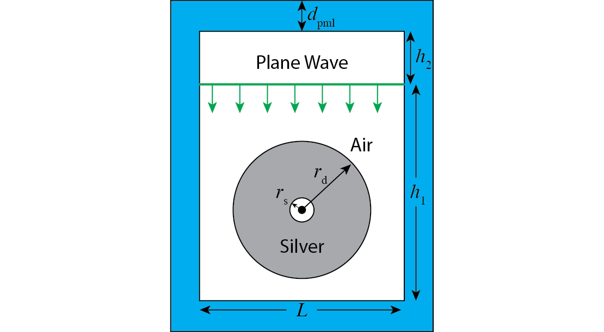
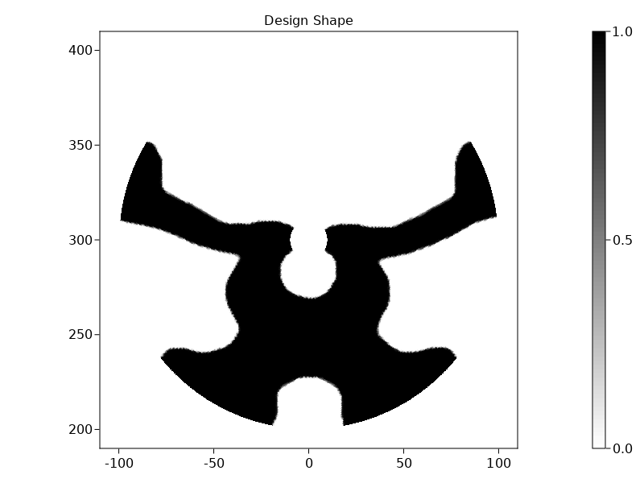
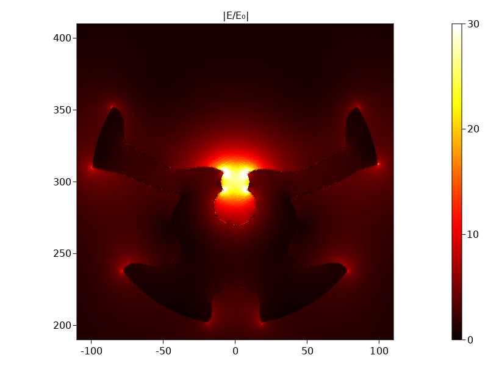

## Problem statement

Consider the following optimization problem adapted from [Christiansen et al. (2020)](http://doi.org/10.1364/OE.28.004444):
We want to design a metallic (silver) nanoparticle to focus an incident $H_z$-polarized planewave on
a single spot, maximizing the electric-field intensity at this focal spot.   The metallic
structure can be *any shape* of *any topology* (any connectivity, number of holes, etcetera)
surrounding the focal spot, as long as the metal lies within an annular "design region" $\Omega_d$:
between a minimum radius $r_s = 10$nm (the minimum distance from the focal spot) and an outer
radius $r_d=100$nm.  The computational cell is of height $h_1=600$ nm, $h_2=200$ nm and length $L=600$ nm, and we employ a perfectly matched layer (PML) thickness of $d_{pml}=300$ nm to implement outgoing (radiation) boundary conditions for this finite domain.

The goal is find the arrangement of the silver material in the gray region that maximizes the |electric field|² at the center (the focal point). Every "pixel" in the gray region is effectively treated as a degree of freedom that can vary continuously between silver (shown in black below) and air (shown in white below). This is called density-based [topology optimization (TO)](https://en.wikipedia.org/wiki/Topology_optimization), and leads to a tractable optimization problem despite the huge number of parameters. A standard "projection" technique, described below, is used to "binarize" the structure by eventually forcing the material to be either silver or air almost everywhere.

## Topology optimization

We use density-based topology optimization (TO) to maximize the electric field intensity at the center. In TO, every point in the design domain is a design degree of freedom that can vary continuously between air ($p=0$) and silver ($p=1$), which we discretize into a piece-wise constant parameter space $P$ for the design parameter $p\in [0,1]$. The material's electric permittivity ε is then given by:

$$
\varepsilon(p) = \left[n_{air}+p(n_{metal}-n_{air})\right]^2, 
$$
where $n_{air}=1$ and $n_{metal}$ are the refractive indices ($\sqrt{\varepsilon}$) of the air and metal, respectively. (It is tempting to simply linearly interpolate the permittivities ε, rather than the refractive indices, but this turns out to lead to artificial singularities in the case of metals where ε can pass through zero [4].) For the silver used in the code, we have the refractive index $n_{metal}=0.054 + 3.429i$ at the considered wavelength $\lambda=532$ nm.

In practice, to avoid obtaining arbitrarily fine features as the spatial resolution is increased, one needs to regularize the problem with a minimum lengthscale $r_f$ by generating a smoothed/filtered parameter function $p_f$.  (Although this regularizes the problem, strictly speaking it does not impose a minimum feature size because of the nonlinear-projection step below. In practical applications, one imposes additional [manufacturing constraints](http://doi.org/10.1364/OE.431188) explicitly.)  We perform the smoothing $p \to p_f$ by solving a simple "damped diffusion" PDE, also called a Helmholtz filter [5], for $p_f$ given the design variables $p$: 
$$
\begin{aligned}    
-r_f^2\nabla^2p_f+p_f&=p\, ,\\
\left. \frac{\partial p_f}{\partial \vec{n}} \right\vert_{\partial\Omega_D} & =0 . 
\end{aligned} 
$$

We choose a filter radius $r_f=R_f/(2\sqrt{3})$ where $R_f=10$ nm, in order to match a published result (using a slightly different filtering scheme) for comparison [6]. 

Next, we apply a smoothed threshold projection to the intermediate variable $p_f$ to obtain a "binarized" density parameter $p_t$ that tends towards values of $0$ or $1$ almost everywhere [6] as the steepness $\beta$ of the thresholding is increased: 
$$
p_t = \frac{\tanh(\beta\eta)+\tanh\left[\beta(p_f-\eta)\right]}{\tanh(\beta\eta)+\tanh\left[\beta(1-\eta)\right]}. 
$$
Note that as $\beta\to\infty$, this threshold procedure goes to a step function, which would make the optimization problem non-differentiable. In consequence, the standard approach is to gradually increase $\beta$ to slowly binarize the design as the optimization progresses [6]. We will show how this is done below.  

Finally, we replace $p$ with the filtered and thresholded $p_t$ in the ε interpolation formula from above:

$$
\varepsilon(p_t) = \left[n_{air}+p_t(n_{metal}-n_{air})\right]^2,
$$
This is the quantity that will be used for the $1/\varepsilon(x)$ coefficient in our Helmholtz PDE.

## Results
The optimized geometry and the corresponding field are displayed below.

We can see that this shape is very close to that from [Christiansen et al. (2020)](http://doi.org/10.1364/OE.28.004444). In particular, the optimized field enhancement $|E/E_0|^2$ is found to be $4 \times$ `g_opt` = 700 at $\beta = 32$ (the factor 4 comes from the incident plane wave amplitude). For comparison, the optimized field enhancement from [Christiansen et al. (2020)](http://doi.org/10.1364/OE.28.004444) is ~1030 after post processing with curve-fitted, finely meshed using second order elements) design. Note that these optimized plasmonic designs are sensitive to minor geometric variations, hence the exact value of the enhancement may fluctuate a few percent depending on minor changes to the geometry. For a simple post processing, let $\beta=80$ and run for a 100 more optimization steps, we obtain $4 \times$ `g_opt` = 980 $\approx$ 1030, proving our results.

