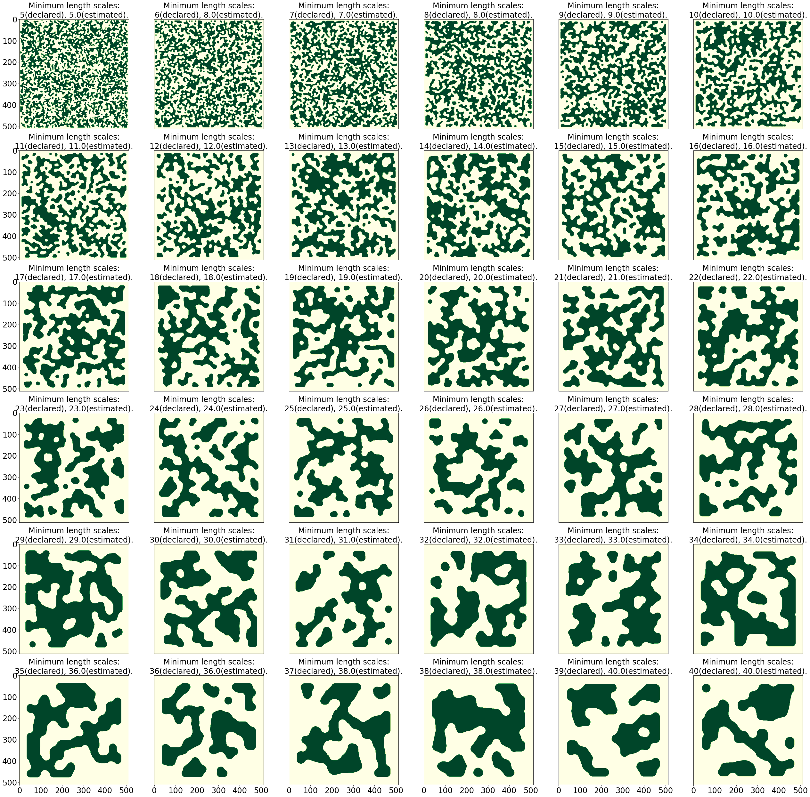

This is a small program for computing the minimum length scale of a 2d design pattern given by topology optimization. The theoretical basis of the method lies in morphological transformations [1,2].

This method is outlined as follows.
1. Normalize and binarize the 2d array of the design pattern. The resultant pattern is composed of 0 and 1. For ease of description, let us refer to a pixel with the value 1 as a solid pixel, and a pixel with the value 0 as a void pixel.
2. For a structuring element with a given diameter, which plays a role as a probe, compute the difference between morphological opening and closing. This difference is still a 2d array with the same shape as the design pattern.
3. Count the number of interior solid pixels in the image of difference. The interior solid pixels are those surrounded by other solid pixels, as shown in the figure below.
4. Repeat Steps 2 and 3 for a series of probe diameters, and seek the minimum diameter at which an interior solid pixel emerges. This diameter is considered as the minimum length scale.

Implementation details affect results, which are usually slightly different from declared minimum length scales that are imposed on designing. Generally, the error of the minimum length scale estimated by this method is at most the size of several pixels. If the minimum length scale is much larger than the pixel size, the error would be relatively small. A few examples are as follows [3].

References  
[1] Linus Hägg and Eddie Wadbro, On minimum length scale control in density based topology optimization, Struct. Multidisc Optim. 58(3), 1015–1032 (2018).  
[2] Rafael C. Gonzalez and Richard E. Woods, Digital Image Processing (Fourth Edition), Chapter 9 (Pearson, 2017).  
[3] These design patterns are provided by @mfschubert.

