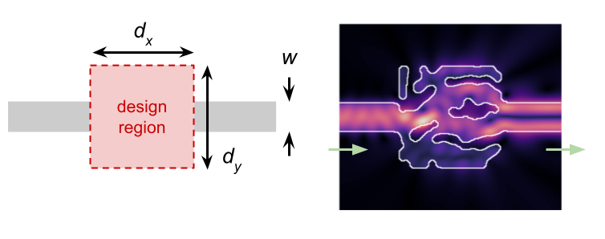

# Waveguide Mode Converter

This is a waveguide mode converter test problem. The design objective is to maximize the conversion of power from the fundamental waveguide mode of the input waveguide to the second-order mode of the output waveguide for the out-of-plane (Ez) polarization. Specifically, the worst-cast (maximum) reflection is minimized and the worst case transmission (minimum) is maximized. The geometry of the device is two-dimensional.

## Schematic



## Parameters

| Parameter                            | Value           |
|--------------------------------------|-----------------|
| Design region width, dx              | 1.6 um          |
| Design region height, dy             | 1.6 um          |
| Waveguide width                      | 400 nm          |
| Solid material relative permittivity | 12.25 (silicon) |
| Void material relative permittivity  | 2.25 (oxide)    |
| Operating wavelength range           | 1260 - 1300 nm  |
| Simulation resolution                | 10 nm           |
| Design pixel size                    | 10 nm           |
| Expected design array shape          | 160 x 160       |

These parameter values correspond to the mode converter demonstrated in
[Inverse Design of Photonic Devices with Strict Foundry Fabrication Constraints](https://doi.org/10.1021/acsphotonics.2c00313).

## Designs

Mode converter designs are under the `designs/` subfolder.

| File                                                     | Description                                                                                             |
|----------------------------------------------------------|---------------------------------------------------------------------------------------------------------|
| converter_schubert_circle_x33491673_w307_s134.csv        | Circular brush design from [Schubert et al. (2022)](https://doi.org/10.1021/acsphotonics.2c00313)       |
| converter_schubert_notched_x33491673_w183_s159.csv       | Notched-square brush design from [Schubert et al. (2022)](https://doi.org/10.1021/acsphotonics.2c00313) |
| converter_generator_circle_{6,8,10,12,14,16,18,20}\*.csv | Circular brush designs of varying minimum feature size optimized via Ceviche                            |
| converter_meep_\*.csv                                    | Designs produced using a filter+projection scheme optimized via Meep.                                   |

## Usage

The mode converter test problem can be run on a list of specified designs via
the `run.py` script.

Running the following:

```
python3 ./run.py designs/converter_*.csv
```

Will produce the output below:
```
# Design file, Length scale (nm), Worst-case reflection (dB), Worst-case transmission (dB)
converter_generator_circle_10_x47530832_w11_s483.csv, 93.75, -22.50, -0.19
converter_generator_circle_10_x47530832_w19_s483.csv, 93.75, -28.30, -0.29
converter_generator_circle_10_x47530832_w27_s681.csv, 105.46875, -27.17, -0.19
converter_generator_circle_10_x47530832_w35_s719.csv, 105.46875, -34.01, -0.24
converter_generator_circle_10_x47530832_w3_s584.csv, 105.46875, -36.30, -0.18
converter_generator_circle_10_x47530832_w43_s590.csv, 105.46875, -37.79, -0.12
converter_generator_circle_10_x47530832_w51_s853.csv, 93.75, -37.49, -0.22
converter_generator_circle_10_x47530832_w59_s920.csv, 93.75, -23.84, -0.21
converter_generator_circle_10_x47530832_w67_s350.csv, 93.75, -29.21, -0.19
converter_generator_circle_10_x47530832_w75_s547.csv, 93.75, -32.32, -0.16
converter_generator_circle_12_x47530832_w12_s248.csv, 111.328125, -28.49, -0.35
converter_generator_circle_12_x47530832_w20_s640.csv, 111.328125, -28.00, -0.29
converter_generator_circle_12_x47530832_w28_s528.csv, 111.328125, -32.18, -0.16
converter_generator_circle_12_x47530832_w36_s982.csv, 117.1875, -28.46, -0.35
converter_generator_circle_12_x47530832_w44_s653.csv, 111.328125, -22.86, -0.34
converter_generator_circle_12_x47530832_w4_s804.csv, 117.1875, -21.20, -0.57
converter_generator_circle_12_x47530832_w52_s954.csv, 111.328125, -20.46, -0.53
converter_generator_circle_12_x47530832_w60_s857.csv, 117.1875, -29.14, -0.24
converter_generator_circle_12_x47530832_w68_s88.csv, 111.328125, -33.10, -0.52
converter_generator_circle_12_x47530832_w76_s364.csv, 111.328125, -26.20, -0.48
converter_generator_circle_14_x47530832_w13_s793.csv, 128.90625, -33.62, -0.19
converter_generator_circle_14_x47530832_w21_s956.csv, 128.90625, -35.49, -0.25
converter_generator_circle_14_x47530832_w29_s991.csv, 140.625, -34.11, -0.51
converter_generator_circle_14_x47530832_w37_s975.csv, 146.484375, -33.08, -0.30
converter_generator_circle_14_x47530832_w45_s878.csv, 128.90625, -29.39, -0.29
converter_generator_circle_14_x47530832_w53_s519.csv, 140.625, -24.07, -0.43
converter_generator_circle_14_x47530832_w5_s139.csv, 140.625, -20.67, -0.58
converter_generator_circle_14_x47530832_w61_s667.csv, 128.90625, -28.21, -0.30
converter_generator_circle_14_x47530832_w69_s668.csv, 140.625, -28.21, -0.22
converter_generator_circle_14_x47530832_w77_s765.csv, 140.625, -25.35, -0.25
converter_generator_circle_16_x47530832_w14_s150.csv, 152.34375, -21.23, -0.81
converter_generator_circle_16_x47530832_w22_s167.csv, 169.921875, -19.71, -1.08
converter_generator_circle_16_x47530832_w30_s624.csv, 152.34375, -26.43, -0.41
converter_generator_circle_16_x47530832_w38_s404.csv, 152.34375, -17.62, -0.88
converter_generator_circle_16_x47530832_w46_s770.csv, 152.34375, -23.29, -0.77
converter_generator_circle_16_x47530832_w54_s109.csv, 152.34375, -19.77, -0.77
converter_generator_circle_16_x47530832_w62_s193.csv, 164.0625, -29.32, -0.61
converter_generator_circle_16_x47530832_w6_s445.csv, 169.921875, -18.98, -0.67
converter_generator_circle_16_x47530832_w70_s892.csv, 164.0625, -20.63, -0.81
converter_generator_circle_16_x47530832_w78_s371.csv, 152.34375, -27.60, -0.81
converter_generator_circle_18_x47530832_w15_s879.csv, 169.921875, -23.66, -0.93
converter_generator_circle_18_x47530832_w23_s228.csv, 169.921875, -22.50, -0.96
converter_generator_circle_18_x47530832_w31_s46.csv, 181.640625, -23.49, -0.86
converter_generator_circle_18_x47530832_w39_s593.csv, 181.640625, -28.45, -0.67
converter_generator_circle_18_x47530832_w47_s439.csv, 181.640625, -31.18, -0.60
converter_generator_circle_18_x47530832_w55_s534.csv, 181.640625, -27.49, -0.79
converter_generator_circle_18_x47530832_w63_s544.csv, 187.5, -19.35, -0.76
converter_generator_circle_18_x47530832_w71_s711.csv, 181.640625, -27.51, -0.74
converter_generator_circle_18_x47530832_w79_s267.csv, 181.640625, -26.93, -0.87
converter_generator_circle_18_x47530832_w7_s311.csv, 187.5, -22.70, -0.86
converter_generator_circle_20_x47530832_w16_s416.csv, 205.078125, -18.43, -1.23
converter_generator_circle_20_x47530832_w24_s997.csv, 205.078125, -20.84, -0.95
converter_generator_circle_20_x47530832_w32_s982.csv, 199.21875, -24.16, -0.66
converter_generator_circle_20_x47530832_w40_s988.csv, 222.65625, -18.16, -1.34
converter_generator_circle_20_x47530832_w48_s996.csv, 205.078125, -19.63, -0.95
converter_generator_circle_20_x47530832_w56_s972.csv, 210.9375, -29.46, -0.86
converter_generator_circle_20_x47530832_w64_s997.csv, 216.796875, -32.20, -0.85
converter_generator_circle_20_x47530832_w72_s846.csv, 210.9375, -22.31, -0.83
converter_generator_circle_20_x47530832_w80_s599.csv, 222.65625, -25.08, -1.04
converter_generator_circle_20_x47530832_w8_s938.csv, 205.078125, -20.08, -0.90
converter_generator_circle_6_x47530832_w17_s412.csv, 58.59375, -41.09, -0.14
converter_generator_circle_6_x47530832_w1_s796.csv, 64.453125, -29.96, -0.09
converter_generator_circle_6_x47530832_w25_s986.csv, 58.59375, -34.60, -0.07
converter_generator_circle_6_x47530832_w33_s242.csv, 58.59375, -30.74, -0.08
converter_generator_circle_6_x47530832_w41_s990.csv, 64.453125, -33.51, -0.09
converter_generator_circle_6_x47530832_w49_s770.csv, 58.59375, -40.64, -0.07
converter_generator_circle_6_x47530832_w57_s968.csv, 58.59375, -34.17, -0.06
converter_generator_circle_6_x47530832_w65_s909.csv, 58.59375, -41.95, -0.04
converter_generator_circle_6_x47530832_w73_s975.csv, 58.59375, -37.55, -0.05
converter_generator_circle_6_x47530832_w9_s893.csv, 58.59375, -33.79, -0.08
converter_generator_circle_8_x47530832_w10_s898.csv, 82.03125, -30.73, -0.13
converter_generator_circle_8_x47530832_w18_s655.csv, 76.171875, -32.76, -0.13
converter_generator_circle_8_x47530832_w26_s710.csv, 76.171875, -33.98, -0.09
converter_generator_circle_8_x47530832_w2_s430.csv, 82.03125, -36.23, -0.09
converter_generator_circle_8_x47530832_w34_s965.csv, 82.03125, -27.76, -0.11
converter_generator_circle_8_x47530832_w42_s878.csv, 76.171875, -27.34, -0.15
converter_generator_circle_8_x47530832_w50_s956.csv, 76.171875, -28.26, -0.06
converter_generator_circle_8_x47530832_w58_s969.csv, 76.171875, -28.66, -0.15
converter_generator_circle_8_x47530832_w66_s878.csv, 82.03125, -29.08, -0.13
converter_generator_circle_8_x47530832_w74_s989.csv, 82.03125, -34.79, -0.11
converter_meep_min_linewidth_50nm.csv, 55.03, -33.79, -0.10
converter_meep_min_linewidth_60nm.csv, 76.77, -33.35, -0.12
converter_meep_min_linewidth_70nm.csv, 76.77, -26.68, -0.30
converter_meep_min_linewidth_80nm.csv, 95.40, -28.40, -0.34
converter_meep_min_linewidth_90nm.csv, 86.08, -26.62, -0.65
converter_meep_min_linewidth_100nm.csv, 86.08, -13.02, -2.09
converter_meep_min_linewidth_125nm.csv, 107.82, -21.985, -2.546
converter_meep_min_linewidth_150nm.csv, 151.30, -16.68, -2.08
converter_meep_min_linewidth_175nm.csv, 163.72, -24.44, -2.80
converter_meep_min_linewidth_200nm.csv, 303.47, -9.56, -1.58
converter_meep_min_linewidth_225nm.csv, 362.47, -30.09, -3.99
converter_schubert_circle_x33491673_w307_s134.csv, 105.46875, -34.11, -0.19
converter_schubert_notched_x33491673_w183_s159.csv, 105.46875, -30.67, -0.26
```
